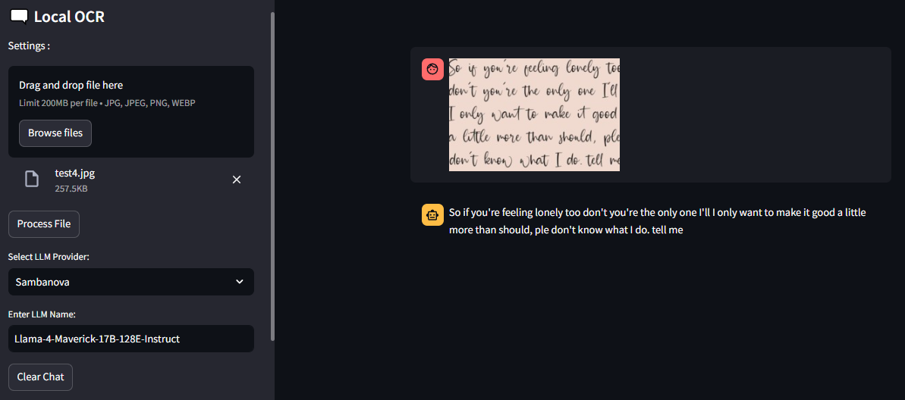

# 🧠 Local OCR Streamlit App

This project is a **local OCR (Optical Character Recognition)** app built with **Streamlit**, enabling users to extract text from images using LLMs.

## 🔍 Features

* 📁 Upload images or PDFs for OCR processing
* 🤖 Use **Ollama** for local LLM-based OCR
* ☁️ Use **Sambanova** cloud API for OCR
* 🧠 Supports multiple models from Ollama
* 🧹 Clear chat history and temp files easily
* 💬 Chat-like interface to view OCR results

---

## ⚙️ Requirements

* Python 3.8+
* [Streamlit](https://streamlit.io/)
* [Ollama](https://ollama.ai/)
* API Key from [Sambanova](https://sambanova.ai/)

---

## 📦 Installation

1. **Clone the repository:**

```bash
git clone https://github.com/drisskhattabi6/Images_OCR_Locally.git
cd Images_OCR_Locally
```

2. **Install dependencies:**

```bash
pip install -r requirements.txt
```

3. **Install Ollama & Pull a Vision Model:**

Make sure [Ollama](https://ollama.ai/) is installed and running.

```bash
ollama pull llama3.2-vision
```

> ⚠️ **Note:** Ollama only supports **images**, not PDFs.

4. **Set up your `.env` file:**

Create a `.env` file and add your **Sambanova API key**:

```
API_KEY=your_sambanova_api_key
```

> 🔐 **Required:** You must have an API key from Sambanova to use their cloud models.

---

## 🚀 Run the App

```bash
streamlit run app.py
```

APP Screenshot:




---

## 📁 Folder Structure

```
local-ocr-app/
├── app.py                  # Main Streamlit app
├── ocr.py                  # OCR logic (local and remote)
├── .env                    # Contains API key  (create the File)
├── requirements.txt        # Python dependencies
└── tmp/                    # Temporary folder for uploaded files (auto-created)
```

---

## ❓ Troubleshooting

* ❌ **No models found in Ollama?**
  Run: `ollama pull llama3.2-vision`

* ❌ **Missing API Key for Sambanova?**
  Make sure `.env` file contains:

  ```bash
  API_KEY=your_key_here
  ```
